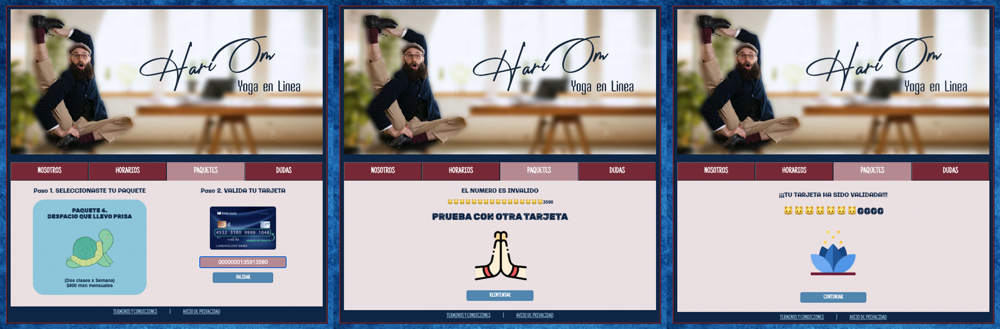

# **CARD VALIDATION**
Se ingresa el número de una tarjeta en un input tex, y a ese valor se le aplica el algoritmo de Luhm si el resultado es valido el usuario puede continuar con su compra. Si es una tarjeta no valida, se le pide que ingrese otra tarjeta o lo vuelva a intentar. Ademas de enmascararse el numero de la tarjeta exceptuando los ultimos cuatro digitos

# INVESTIGACION UX
## **HARI OM - YOGA EN LINEA**
### **_¿QUIENES SOMOS?_**
Somos un grupo practicantes asiduos de yoga con  mas de 10 años de experiencia como docentes, que decidio dar un paso a lo diigital. Ofreciendo la posibilidad de seguir cuidadndo de ti, de tu mente y tu cuerpo mediante una practica regular, en la comodidad de tu casa sin tener que desplazarte, o exponerte a algun inconveniente. Transformando el tiempo de translado a un tiempo de autocuidado.

### **PRINCIPALES USUARIOS**
Adultos entre 20 -75 años y empresas, emprendimientos, todo aquel que busque eficientar y llevar bienestar a sus colaboradores.

### **¿Cuáles son los objetivos de estos usuarios en relación con tu producto?**
* _PERSONAS_
    * Bienestar
    * Manejo del estres
    * Fortalecimiento
    * Consciencia de si mismo 

    

* _EMPRESAS_
    * Evitan el Bournout
    * Y cumplen con los estatutos de la Ley federal del trabajo (2019)
    * Aumenta la productividad y motivacion del pesonal
    * Mejora el ambiente laboral 
    * Promueve la creatividad

    

## **¿Cómo crees que el producto que estás creando está resolviendo sus problemas?**
Mexico tienes alto indicces de obesidad, hipertension y diabetes en su poblacion. con la promoviendo este tipo de actividades que abordan estas tematicas de manera integral, promueve  un desarrollo de conciencia y mejoramiento del estilo de vida  a nivel social.
A lxs usarixs los conecta de una manera eficaz y rapida, con quienes les pueden ayudar a alcanzar sus objetivos. Eficientando tiempos y disminuyendo riesgos.

De modo tal que sus servicios al ser completamente en linea, se vuelve incongruente que su pago requiera ser presencial.       

 >_"LOKAH SAMASTAH SUKHINO BHAVANTU"_  
 >¡QUE TODOS LOS SERES DE TODOS LOS UNIVERSOS SEAN FELICES Y PROSPEROS!
